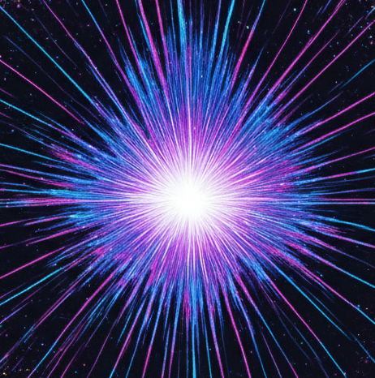

<i><b>"Unify Computer Vision, Expand Computer Vision, Transcend Computer Vision."</b></i>

This org aims to define and guide the development of the Computer Vision field -- by releasing Top Open-source Vision models. This page is essentially a larger organization's README and information summary.

## Overview

e.classList.remove('active'));this.classList.add('active');">News&#8204;e.classList.remove('active'));this.classList.add('active');">Roadmap

- **2025 Feb 7:** Guideline "Model Design Guideline Memo" completed.
- **2025 Jan 23:** Blog "Tensors are Basis of Light" completed.
- **2025 Jan 18:** Blog "Pixel Grandfather Paradox" completed.
- **2025 Jan 3:** Blog "Time Flowing in Graphics" and "Relative be in All Things" completed.
- **2024 Dec 25:** Blog "Create Laplace's Demon" completed.
- **2024 Dec 24:** Blog "Rethink Best Papers" and "Computer Vision's Rebirth" completed.
- **2024 Dec 23:** Blog "Discuss Real World Models" completed.
- **2024 Dec 21:** About 4:27-5:05 a.m., "The Song of Computer Vision (2026)" completed.
- **2024 Dec 20:** About 2:38 a.m., BOOM! The ideas for the project began to emerge continuously.

## Template

We have dedicated templates for our organization, documentation and derivative work: 
- **Personal/Organization Page:** [[Repo]](https://github.com/World-Snapshot/world-snapshot.github.io) [[Demo]](https://world-snapshot.github.io)
- **Paper/Project Page:** [[Repo]](https://github.com/World-Snapshot/WSMs) [[Demo]](https://world-snapshot.github.io/WSMs)
- **Document/UI/Material:** [[Repo]](https://github.com/World-Snapshot/doc) [[Demo]](https://world-snapshot.github.io/doc)

 

